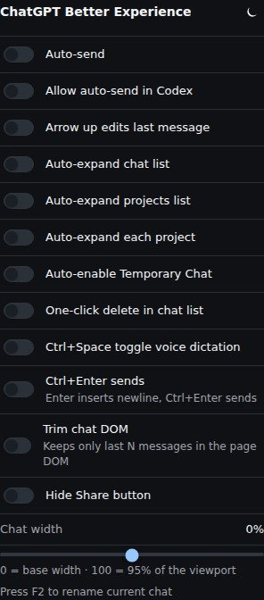

# chat-gpt-better-experience

Better experience like in n mobile app

## Extension

Firefox Add-ons: https://addons.mozilla.org/en-US/firefox/addon/chatgpt-better-expierience/

## Documentation

- [AutoSend + CtrlEnterSend specification](docs/auto-send-spec.md)

## How to release

1. Ensure the working tree is clean and checks pass:
   - `npm run verify`
2. Update the version in `manifest.json` (and anywhere else required by the store).
3. Build the extension bundle:
   - `npm run build`
4. Package the build output per store requirements and submit.

## UI preview

<!-- popup-screenshot:start -->

<!-- popup-screenshot:end -->
